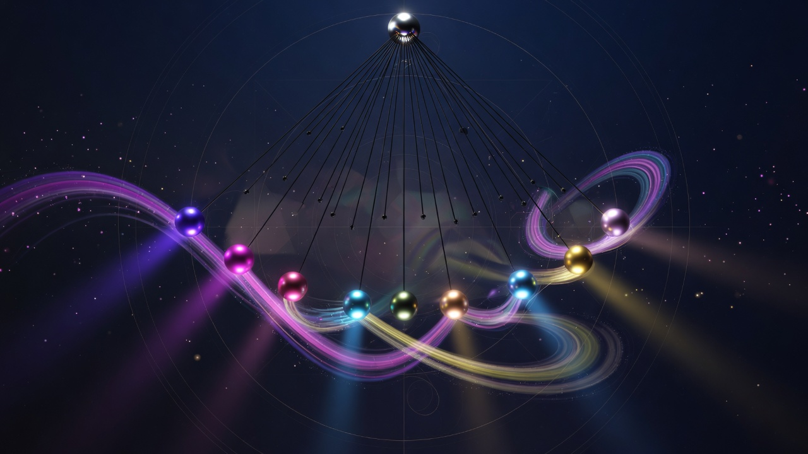
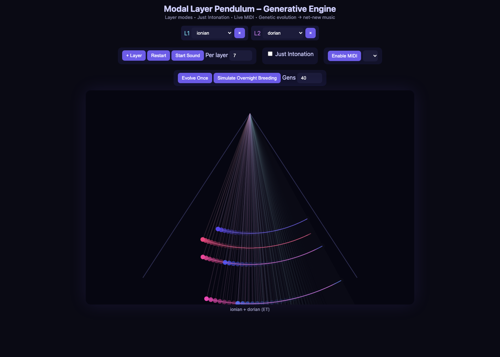
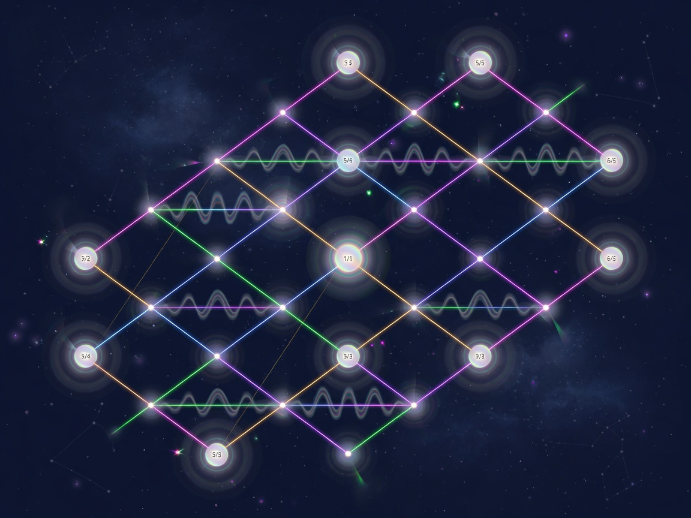
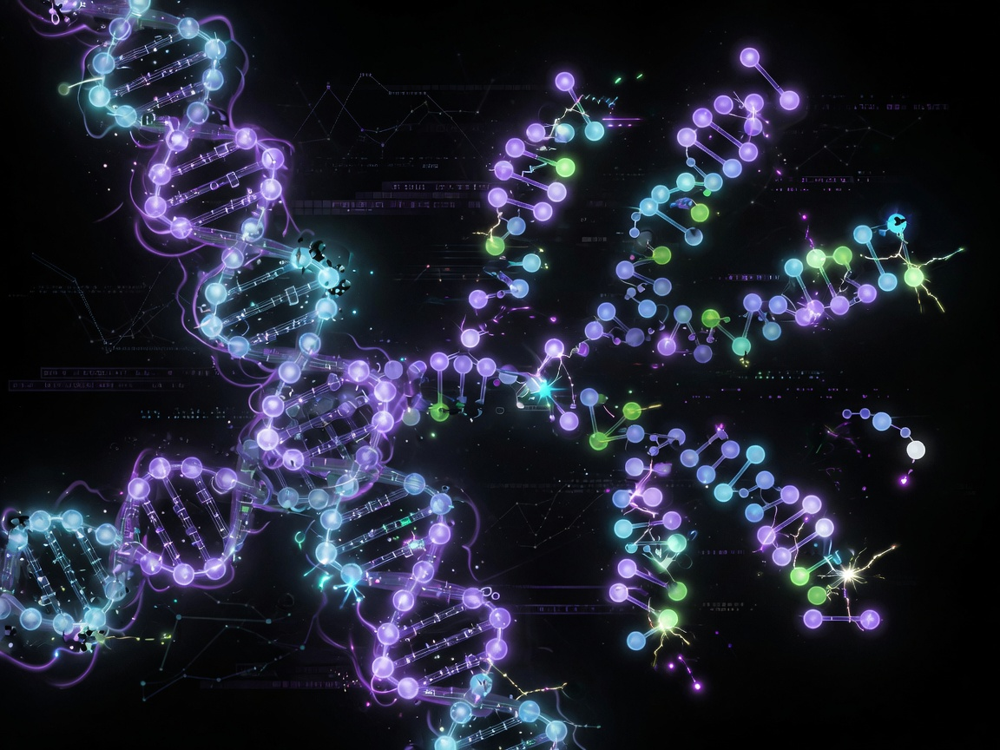
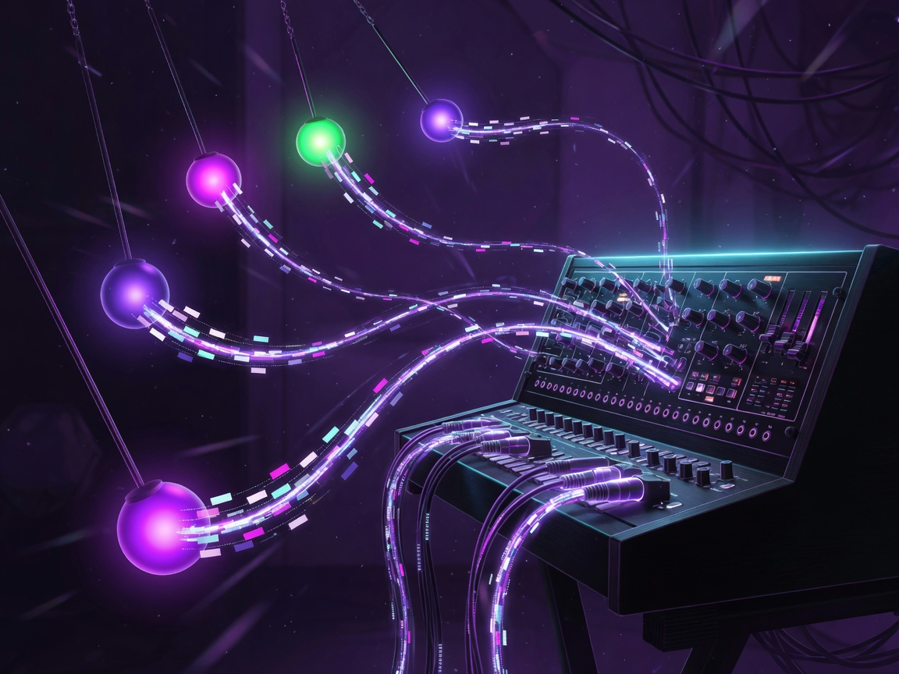

<p align="center">
  
</p>

<h1 align="center">Pendoleum</h1>

<p align="center">
  <strong>Modal Layer Pendulum</strong> — a generative music organism in one HTML file.<br/>
  Stack modes · collide in Just Intonation · stream MIDI · breed new scales.
</p>

<p align="center">
  <a href="index.html"></a>
  
  
  
</p>

<p align="center">
  
</p>

---

## Live instrument

Open the real app — no build step, no install:

```bash
# Option A — double-click
open index.html

# Option B — local server (recommended for MIDI on some setups)
npx --yes serve .
```

Then in **Chrome / Edge / Brave**:

1. Stack 2–4 modes (try **Dorian + Phrygian + Lydian**)
2. Hit **Start Sound** (pitches land ~196 Hz and up so laptop speakers can hear them)
3. Per layer: set **mode**, **key**, **octave**, and **speed** (exact rationals ×1/8 very slow … ×8; default ×1/4 so each peak is hearable)
4. Toggle **Just Intonation** and listen to the pure-ratio collisions
5. **Record** → play → **Stop & Save** to download a WebM of the audio
6. **Stop** = hard silence + freeze (+ suspend audio). **Mute** = silence only. **Pause** freezes motion.
7. **Enable MIDI** → route to a DAW or hardware synth
8. **Simulate Overnight Breeding** → load evolved DNA as new layers (**Cancel Breed** if needed)

<p align="center">
  
</p>

---

## What it is

Pendoleum turns **modal harmony**, **pendulum physics**, and a **genetic algorithm** into one closed creative loop:

```text
layer modes  →  physical & sonic collision  →  evolve scale DNA  →  feed back  →  audio + MIDI
```

Every pendulum is a living oscillator: its length and motion are bound to pitch. Peaks fire MIDI. Energy drives Web Audio amplitude. Evolved scales become playable layers — the system invents music that never existed before, then plays it.

---

## Features

<table>
  <tr>
    <td width="33%" valign="top">
      <br/>
      <strong>Just Intonation</strong><br/>
      <span>Toggle pure ratios (3/2, 5/4, 6/5…) against equal temperament. Beats and color change immediately — microtonal collision you can see and hear.</span>
    </td>
    <td width="33%" valign="top">
      <br/>
      <strong>Genetic Mode Evolver</strong><br/>
      <span>Real GA: population, mutate, crossover, fitness on harmonic purity + novelty. Evolve once or “overnight breed” dozens of generations in seconds.</span>
    </td>
    <td width="33%" valign="top">
      <br/>
      <strong>Live MIDI Out</strong><br/>
      <span>Web MIDI on Chromium. Peaks of motion send notes to hardware or soft synths so the living collision leaves the browser.</span>
    </td>
  </tr>
</table>

| Pillar | What you get |
|--------|----------------|
| **Layered modes** | Up to 5 modal layers (Ionian → blues, pentatonics, custom evolved scales) |
| **Integer-ratio speeds** | Swing rates are integer factors (e.g. JI ionian `24:27:30:32:36:40:45`) so periods nest with no remainder; extra pendulums stack octaves by ×2 |
| **Physics canvas** | Pendulum trails, multi-hue layers, real-time energy |
| **Web Audio** | Sine bank per pendulum, gesture-gated Start Sound |
| **JI / ET** | Full mode tables in both tunings |
| **Genetic loop** | Offspring inject as new modes under the layer cap |

---

## Creative loop

```text
┌─────────────┐     ┌──────────────┐     ┌─────────────┐     ┌──────────┐
│ Stack modes │ ──► │ Collide (JI) │ ──► │ Evolve DNA  │ ──► │ MIDI out │
└─────────────┘     └──────────────┘     └─────────────┘     └──────────┘
        ▲                                       │
        └──────────── reload as layers ─────────┘
```

1. **Compose** — add layers, pick modes, set pendulums per layer  
2. **Collide** — start sound; enable JI for pure-ratio beating  
3. **Export** — Enable MIDI → pick an output device  
4. **Evolve** — Evolve Once or Overnight Breeding → new scales land as layers  
5. **Repeat** — the machine feeds its own inventions back into itself  

---

## Browser support

| API | Primary | Notes |
|-----|---------|--------|
| Web Audio | Chromium ✓ | Requires a user gesture (Start Sound) |
| Web MIDI | Chromium ✓ | Needs a device; fails gracefully with status text |
| Canvas rAF | All modern | Visual loop always runs |

**Target:** modern Chromium (Chrome, Edge, Brave). Safari / Firefox: visuals work; MIDI may be limited or absent — the UI stays usable.

---

## Project layout

```text
pendoleum/
├── index.html              ← the instrument (runtime source of truth)
├── idea1.md                ← original prototype narrative + source
├── README.md
└── docs/
    ├── assets/             ← hero, icon, features, screenshot
    ├── architecture/       ← ironclad design packet
    └── plans/              ← ship plan + acceptance log
```

Single-file by design: open `index.html` and play. No bundler, no backend, no accounts.

---

## Hardening (v3 ship)

- Local `customModes` for evolved scales  
- Graceful **Web Audio** missing / blocked resume messaging  
- Graceful **MIDI** unavailable / empty-output messaging  
- **Layer cap** (5) enforced on genetic inject — modes still save when full  

Sonic defaults (physics constants, fitness targets, gain) match the original idea1 prototype.

---

## License & credit

Experiment freely. Built as a closed-loop generative instrument: modes × physics × evolution × MIDI.

<p align="center">
  <br/>
  <em>Open it. Breed something. Listen to what modes + physics + evolution invent.</em>
</p>
